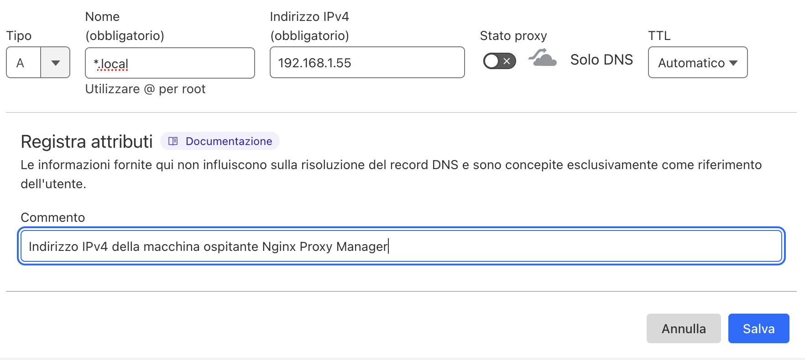
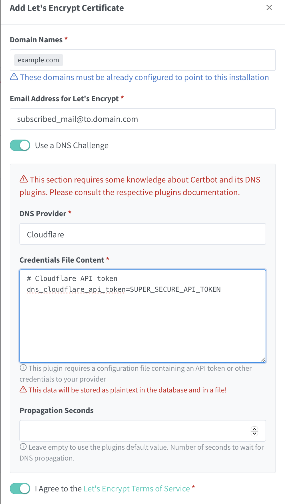

## HomeLab

I run a HomeLab with very basic functionality, for example:
- HomeAssistant
- Paperless
- Trilium Notes

I've always accessed these services through Cloudflare Tunnel and never had a bad experience using it,
but it always bothered me to publish all my services to the open internet and make them accessible to anyone.

So over time I considered using a VPN, so that only myself and the people I grant access to could use these services.
This decision comes with some drawbacks, like not being able to share documents from Paperless via link, or losing some of the
"**away from zone**" features in HomeAssistant — nothing that a hybrid solution can't mitigate.

To give some context on my HomeLab structure, I have a [MiniPC](https://www.amazon.it/dp/B0CXCT4M2F) running Proxmox. Inside it
there's an LXC container for the Cloudflare Tunnel, which up to now (together with the Cloudflare dashboard configuration panel)
has acted as a Reverse Proxy for the services I wanted available outside my network.

## Tailscale subscription
After reading on subreddits and watching YouTube (bless YouTube), I came across several people using Tailscale,
a VPN provider with an excellent free tier for hobbyists, based on WireGuard.
At that point I created an account, connected my PC and phone for the initial setup, and
started planning what I would need to configure from there.

## Nginx Proxy Manager
I decided to use a new LXC container with [Nginx Proxy Manager](https://community-scripts.github.io/ProxmoxVE/scripts?id=nginxproxymanager) for the Reverse Proxy role.
Once installed, I just had to configure my SSL certificate under "SSL Certificates" using Cloudflare as the provider.

### Cloudflare
To use Cloudflare as a Let's Encrypt provider you need to generate a token from the Cloudflare dashboard, going to **Manage Account > API Tokens**. From there you create a new token with the "Edit DNS Zone" permission and save it for later.\
Also, while you're there, go to your domain panel under **DNS** and add a new entry configured for the local network.

### Nginx configuration

Back on Nginx, you can finalize the SSL certificate configuration and add your first host.
Go to "Add SSL Certificate" and select Let's Encrypt.\
Then enter your domain, check "Use DNS Challenge" and configure it for your provider — in this case Cloudflare.

The last bit of Nginx configuration, to make sure things work going forward, is to register a new host.\
You can do that directly under "**Hosts > Proxy Hosts**" and configure the new proxy.


**Warning!** Make sure to use the same domain you entered earlier.


Once the new proxy is configured, try connecting directly with the new URL and check that you can reach your service.

For any other questions on configuring Nginx, here's a video by Wolfgang who explains the basics very well, including how to get it running with DuckDNS.



### Tailscale configuration

I had some trouble accessing my local network through Tailscale, because for some reason I was convinced that simply configuring a host would be enough — in the case of Nginx — to immediately reach the surrounding network. Unfortunately I learned the hard way that's not the case, but let's go step by step.

First, you need to install the [Tailscale add-on](https://community-scripts.github.io/ProxmoxVE/scripts?id=add-tailscale-lxc) on an LXC container. In my case I decided to install it in the same container as Nginx for convenience, but you can create a dedicated one just for this.

Once that's done, just keep following the documentation to get it working as a regular Tailscale node. But that's not what we want — we want this node to act as a "bridge", exposing a subnet to the rest of the devices connected to the VPN.

To make it a bridge with the rest of the network, you need to take a couple of steps. Here are the links:
- [Subnet Routes](https://tailscale.com/kb/1019/subnets)
- [Exit Nodes](https://tailscale.com/kb/1103/exit-nodes)

To explain step by step what I did:

1. Enable IP forwarding
2. Advertise the subnets I'm interested in to Tailscale
3. Approve those subnets from the Tailscale control panel
4. Configure the Tailscale client to allow connections to other nodes on the local network
5. Mark the Tailscale client as an "exit node"

In practice, these two wiki pages let me complete exactly the configuration I wanted: remote access to my home network as if I'd never left home.

## Final configuration

As mentioned above, I have some services that should NEVER be directly accessible from the open internet, like Nginx, but others that to function properly need a properly configured tunnel — take HomeAssistant for example.\
So I decided to apply a hybrid rule for my needs, leaving some containers protected behind the VPN and others reachable through the Cloudflare Tunnel.
Some examples:

- VPN
    - Nginx
    - Vikunja
    - Trilium
- Tunnel
    - HomeAssistant
    - Paperless

## Conclusion

I think this was a great experiment to learn how to use Tailscale, and I'll definitely keep using it (I already have a few ideas with n8n in mind). I also believe it should be the default choice in many cases when deciding to self-host services at home.
